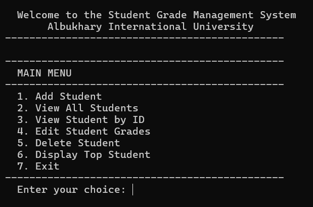
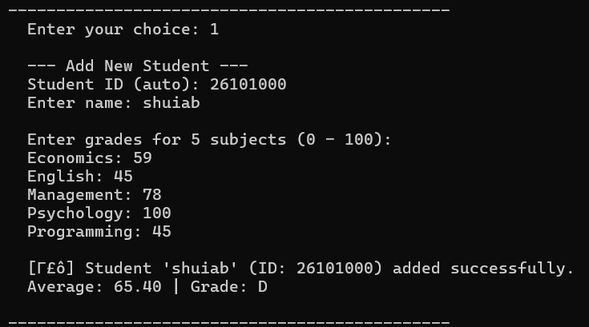
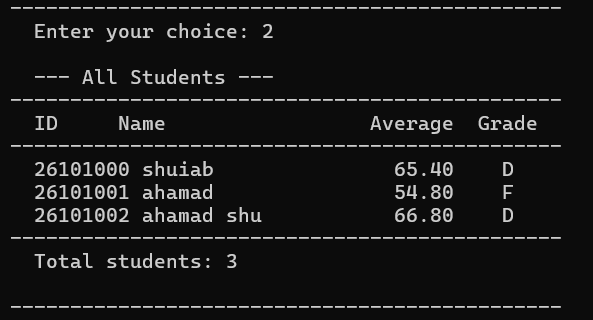
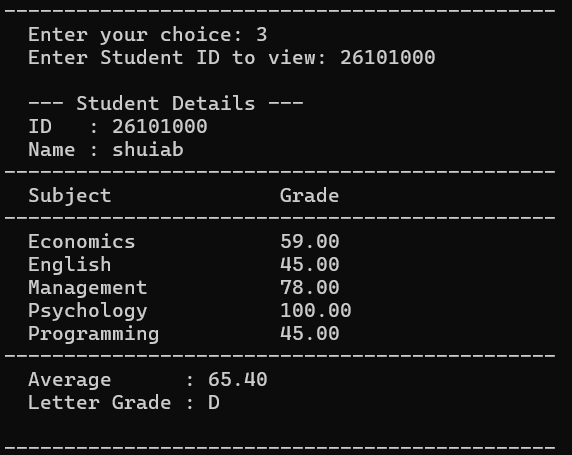
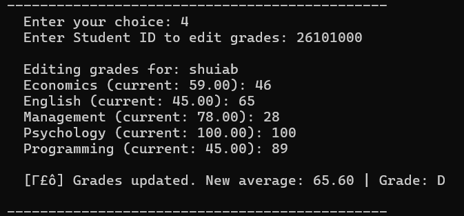
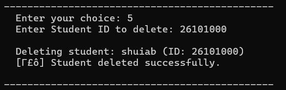
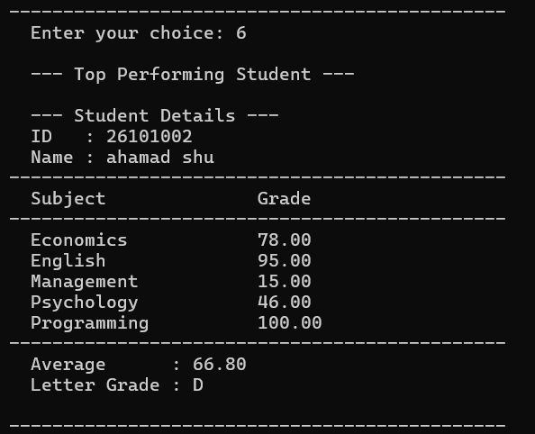
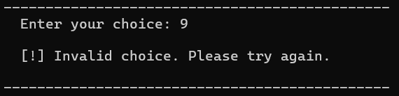
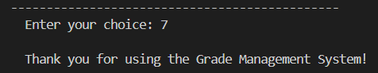

# Student Grade Management System
**FCC124 - Introduction to Programming**
Albukhary International University

---

## 📋 Project Overview

A console-based Student Grade Management System developed in C. The system allows users to add, view, edit, and delete student records, along with automatic grade calculation and top student display.

---

## 👥 Group Members

|      Name       | Student ID  |
|-----------------|-------------|
| Shuaib Ahamad   | AIU25101084 |
| Kaung Thiha     | AIU25101096 |
| Md Nabidul Huda | AIU25101093 |
| Mohamed Irham   | AIU25101072 |
| Ahmed           | AIU25101119 |

---

## 📁 Project Structure

```
student-grade-management/
│
├── Student_grade_management_System.c   # Main source code
│
├── screenshots/                        # Program output screenshots
│   ├── main_menu.png
│   ├── add_student.png
│   ├── view_all_students.png
│   ├── view_student_by_id.png
│   ├── edit_student_grades.png
│   ├── delete_student.png
│   ├── display_top_student.png
│   ├── invalid_input.png
│   └── exit.png
│
├── slid.pptx
│
├── Documentation.pdf
│
└── PROJECT BACKGROUND&PROBLEM STATEMENT.pdf
    
```

---

## ⚙️ Features

- **Add Student** — Auto-generates Student ID starting from 26101000
- **View All Students** — Displays all students in a formatted table
- **View Student by ID** — Shows detailed info including subject grades
- **Edit Student Grades** — Update grades and recalculate average
- **Delete Student** — Remove a student record from the system
- **Display Top Student** — Finds and displays the highest-performing student
- **Input Validation** — Handles invalid inputs and out-of-range grades

---

## 📚 Subjects Covered

1. Economics
2. English
3. Management
4. Psychology
5. Programming

---

## 🔢 Grading Scale

| Average Score | Letter Grade |
|---------------|--------------|
| 90 – 100      | A            |
| 80 – 89       | B            |
| 70 – 79       | C            |
| 60 – 69       | D            |
| Below 60      | F            |

---

## 🖥️ Program Output Screenshots

### Main Menu


### Add Student


### View All Students


### View Student by ID


### Edit Student Grades


### Delete Student


### Display Top Student


### Invalid Input Handling


### Exit


---

## 🔧 How to Compile and Run

### 💻 Local Compiler

**Using GCC (MinGW on Windows):**
```bash
gcc Student_grade_management_System.c -o grade_system
.\grade_system
```

**Using Code::Blocks or VS Code:**
- Open the `.c` file and press **Run** or **F5**

---

### 🌐 Online Compiler (No Installation Required)

You can run this program directly in your browser without installing anything.

#### Option 1 — OnlineGDB 
1. Go to [https://www.onlinegdb.com/online_c_compiler](https://www.onlinegdb.com/online_c_compiler)
2. Delete the default code in the editor
3. Paste the contents of `Student_grade_management_System.c`
4. Make sure the language is set to **C**
5. Click **▶ Run**

#### Option 2 — Programiz 
1. Go to [https://www.programiz.com/c-programming/online-compiler](https://www.programiz.com/c-programming/online-compiler)
2. Delete the default code in the editor
3. Paste the contents of `Student_grade_management_System.c`
4. Click **▶ Run**

> ⚠️ **Note:** Since this program uses interactive input (`scanf`), make sure to type your inputs in the console/terminal panel when prompted.


---

## 📌 Notes

- Maximum students supported: **5**
- Maximum subjects: **5**
- Grades are clamped between **0 and 100**
- Student IDs are auto-assigned sequentially

---

*Submitted for FCC124 - Introduction to Programming | Albukhary International University*
